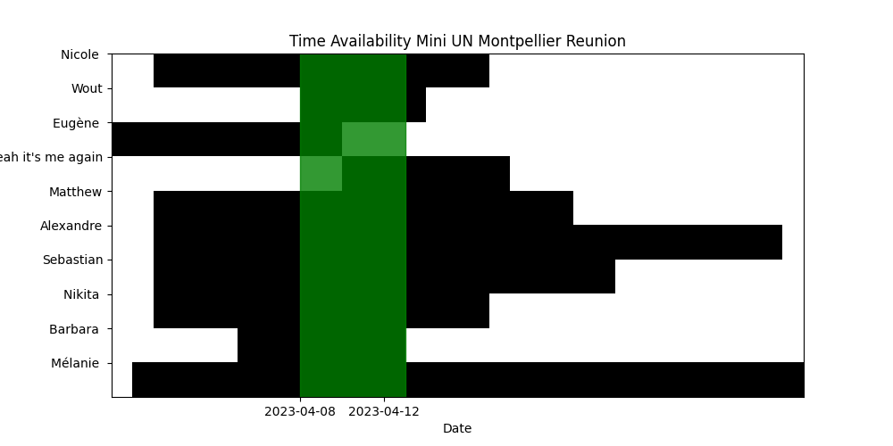

# Mini UN Reunion Availability

Here's a brief guide on how to clone or download this repository and run the code:

Clone or download the repository by clicking on the green "Code" button on the repository page, then select "Download ZIP" to download the repository as a ZIP file, or copy the repository URL and run the command `git clone https://github.com/Youjinium/Mini_UN_Reunion_Availability.git` on your command line interface to clone the repository.

Extract the downloaded ZIP file (if applicable) and navigate to the repository folder.

Make sure you have the required dependencies installed: matplotlib, numpy, and pandas. If you don't have them installed, you can install them using pip.

Run the code by executing the command python `python main.py` in your command line interface.

The program should display a plot showing the availability of people over time, with the best time range highlighted in green.

# Mini UN Reunion Availability Graph:
